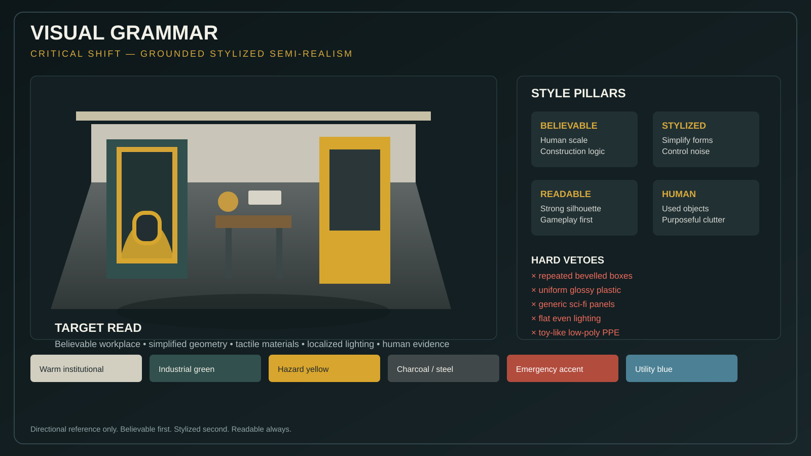
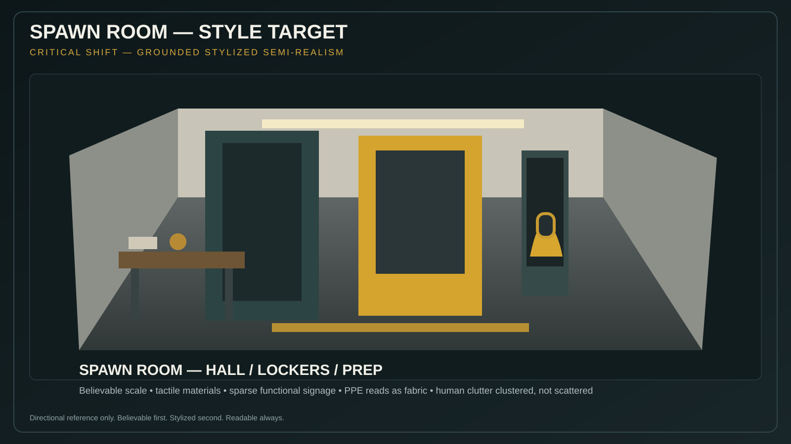
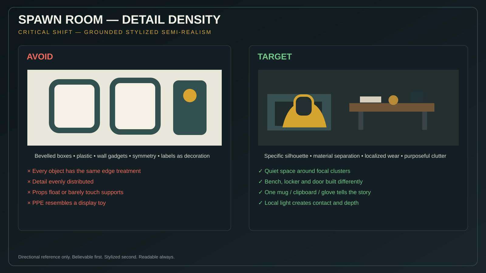
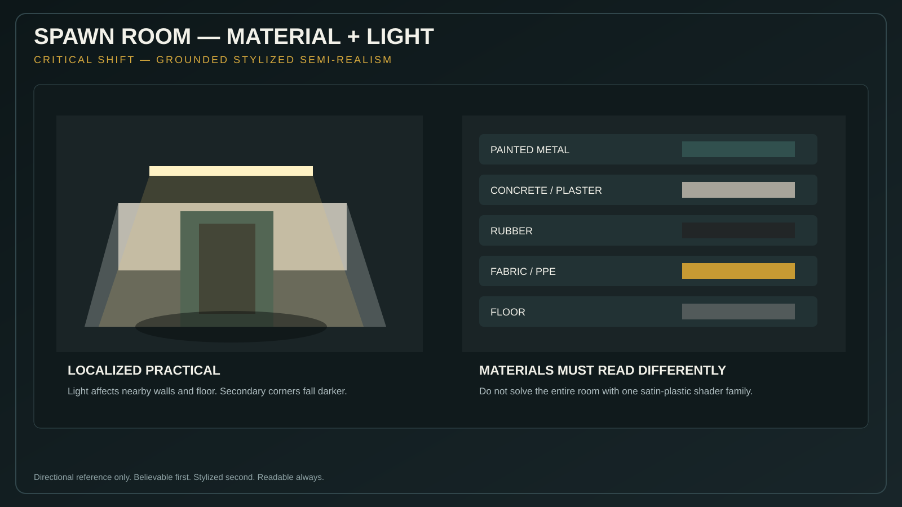
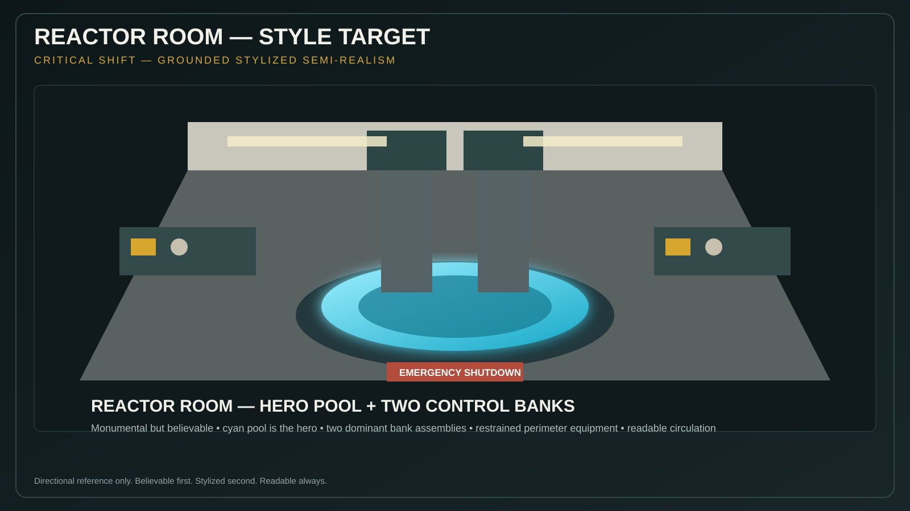
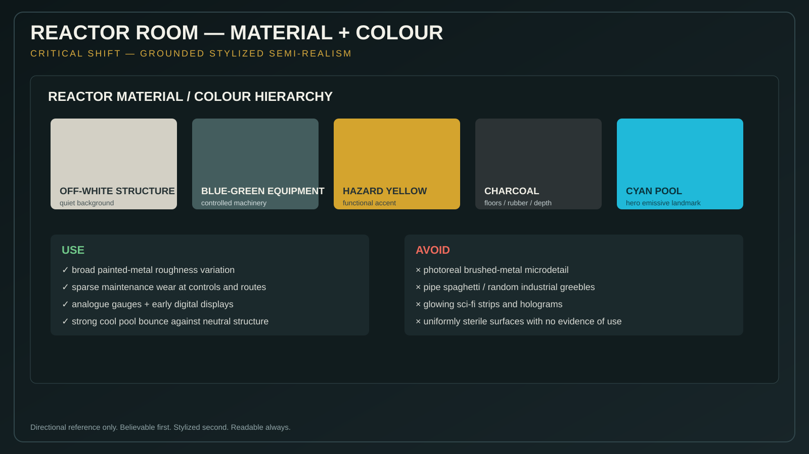
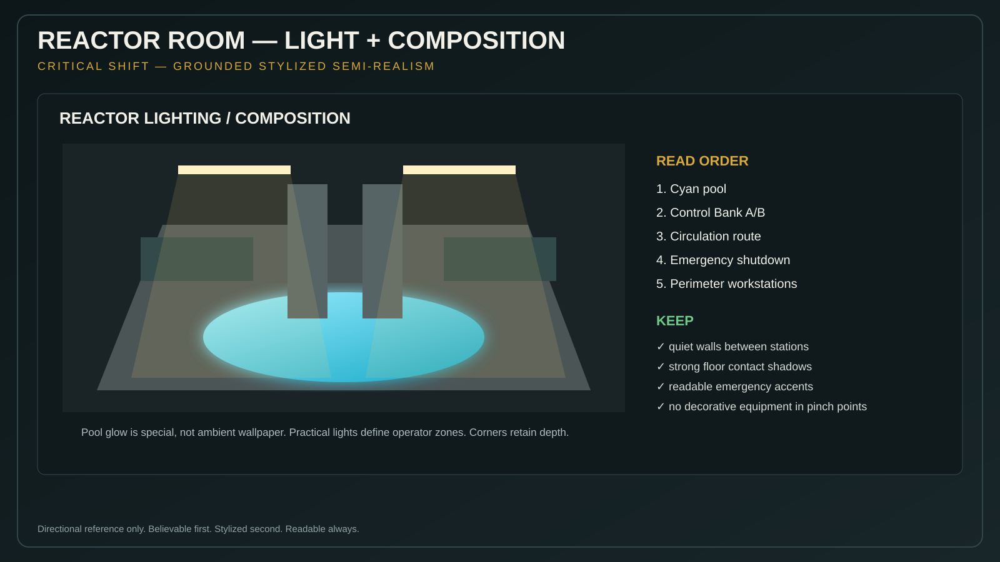

# Art Reference Index

**Status:** mandatory visual-reference map  
**Authority:** [ART_DIRECTION.md](ART_DIRECTION.md)

The generated reference plates in this repository are directional art guides. They exist to make the written rules visually harder to misinterpret. They are **not** geometry blueprints, texture sources, or instructions to copy another game's protected assets.

## Global

Use this board to calibrate the project-wide target:
- grounded stylized semi-realism;
- believable human scale;
- medium-complexity simplified geometry;
- tactile material separation;
- localized lighting;
- sparse, meaningful wear;
- negative space;
- human environmental storytelling.

## Spawn Room

The Spawn Room now has a dedicated, much more detailed visual bible:

- [Spawn Room Visual Reference Bible](../sections/spawn-room/art/SPAWN_REFERENCE_BIBLE.md)

It is backed by a numbered **25-plate** reference library covering composition, floor plan, hallway, briefing room, locker room, suit bays, hazmat suit, integrity chamber, chamber states, radiation checkpoint, doors/walls, ceiling/floor, furniture, scale, materials, colour, lighting, signage, wall graphics, props, larger-building illusion, camera validation and do/don't examples.

Primary generated references:

The spawn section must read as a used institutional preparation/work area, not a low-poly sci-fi showroom. Preserve gameplay layout where useful, but rebuild the visual language around believable doors, lockers, furniture, PPE, construction, materials and lighting.

## Reactor Room

Primary generated references:

The reactor section must read as clean, maintained, monumental industrial science fiction grounded in real construction logic. The cyan pool is the hero landmark; exactly two dominant control-bank assemblies remain visually primary.

## Reference priority

When references conflict, use this order:

1. gameplay dimensions and interaction requirements in section/game specifications;
2. [ART_DIRECTION.md](ART_DIRECTION.md);
3. section-specific generated reference plates in this index;
4. real-world industrial reference for construction logic;
5. external games only as high-level art-direction principles.

## External influence rule

Valorant and PEAK are influence labels only:
- Valorant: environment simplification, material control, readable shape language and colour blocking;
- PEAK: readability, restraint, silhouette clarity and low visual noise.

Never copy their assets, maps, characters, branding, textures or distinctive designs.
