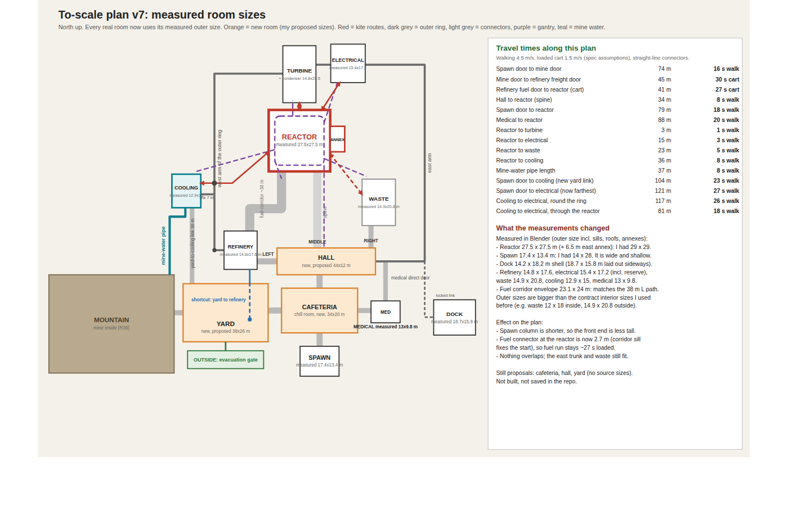

# Facility layout proposal (v7)

**Status: proposal only.** Drafted with the owner on 2026-10-04. It has not been reviewed or accepted, nothing in it is built,
and it does not change the current assembled map, which is being retired (see `AGENTS.md`). It is a layout for the map
that replaces it. Room modules are not edited; the plan assumes new doors and connectors are cut wherever a link needs one.

## Layout in one paragraph
Spawn opens into a chill room and cafeteria. A west door leads to a yard and the mountain with the mine; a door on the
east side leads to medical. A hall beyond the cafeteria splits left, middle and right. Left is the refinery, which sits in
one straight line with the yard (freight in) and the fuel corridor (fuel out). The middle exit is a straight 34 m spine to
the reactor. The reactor is the centre of an outer ring: turbine to its north, electrical to the north-east, waste to the
south-east, cooling to the south-west, the fuel corridor arriving from the south-west. An outer ring runs round the
stations as a bypass, and an overhead gantry over the reactor hall links to the stations. The compliance dock hangs off the
east trunk. The yard has an evacuation gate and a direct 36 m link to the cooling plant.

## Decisions taken with the owner
- Reactor is the centre; every room that can fail is one spoke away.
- Do not move rooms to fit existing doors. New doors are cheap and a good layout is not.
- Cooling is a semi-detached outdoor plant south-west of the reactor, with a short covered link, not a loose building.
- Yard to refinery to fuel corridor are in one straight line.

## Travel times on this plan
Walking 4.5 m/s, loaded cart 1.5 m/s (spec assumptions in `design/GAME_SPEC.md` 23.2), straight connector lengths only.

| Route | Distance | Time |
|---|---|---|
| Spawn door to mine door | 74 m | 16 s |
| Mine door to refinery freight door | 45 m | 30 s |
| Refinery fuel door to reactor (cart) | 41 m | 27 s |
| Hall to reactor (spine) | 34 m | 8 s |
| Spawn door to reactor | 79 m | 18 s |
| Medical to reactor | 88 m | 20 s |
| Reactor to turbine | 3 m | 1 s |
| Reactor to electrical | 15 m | 3 s |
| Reactor to waste | 23 m | 5 s |
| Reactor to cooling | 36 m | 8 s |
| Mine-water pipe length | 37 m | 8 s |
| Spawn door to cooling (new yard link) | 104 m | 23 s |
| Spawn door to electrical (now farthest) | 122 m | 27 s |
| Cooling to electrical, round the ring | 117 m | 26 s |
| Cooling to electrical, through the reactor | 81 m | 18 s |

Spec targets: adjacent 10 to 20 s, mine to refinery 20 to 35 s, refinery to reactor 15 to 30 s, full crossing under 60 s.
Tightest: the fuel run (27 s loaded of 30) and mine to refinery (30 s loaded of 35).

## Measured room sizes
See [MEASURED_ROOM_SIZES.md](MEASURED_ROOM_SIZES.md). Every real room is drawn at its measured outer size.
The cafeteria, hall, yard and lobby have no source sizes (34 x 20, 44 x 12, 38 x 26 and 8 x 4 m respectively) and are proposals.

## What the real doors look like (from each room's `contracts/interface.json`)
- Refinery: freight door west wall, fuel door east wall, personnel door south wall, north wall solid.
- Turbine: two doors, reactor end and electrical end. Electrical: turbine, waste and reserve. Medical: one door.
- Dock: one facility connector plus a sealed external arrival. Fuel corridor: five ports, a fixed 38.2 m L path.
- The plan needs new doors on the reactor, turbine, electrical, medical, refinery, waste and cooling. Doors were not checked on the meshes.

## Known gaps
- Not checked: gantry attachment points on each room, door positions on the meshes, and whether the new rooms fit the art budget.
- The reactor's own door list was taken from the old port list, not its contract.
- Straight-line connector lengths understate real walking distance.
- Whether the refinery counts as a fault room, and what the hall's middle and right exits finally do, were left to the owner.

## Files
- `plan_v7.svg` / `plan_v7.png`: the plan. `generate_plan.py` redraws the SVG.
- `MEASURED_ROOM_SIZES.md`: measurements. `measure_rooms.py` is the Blender script that produced them.
