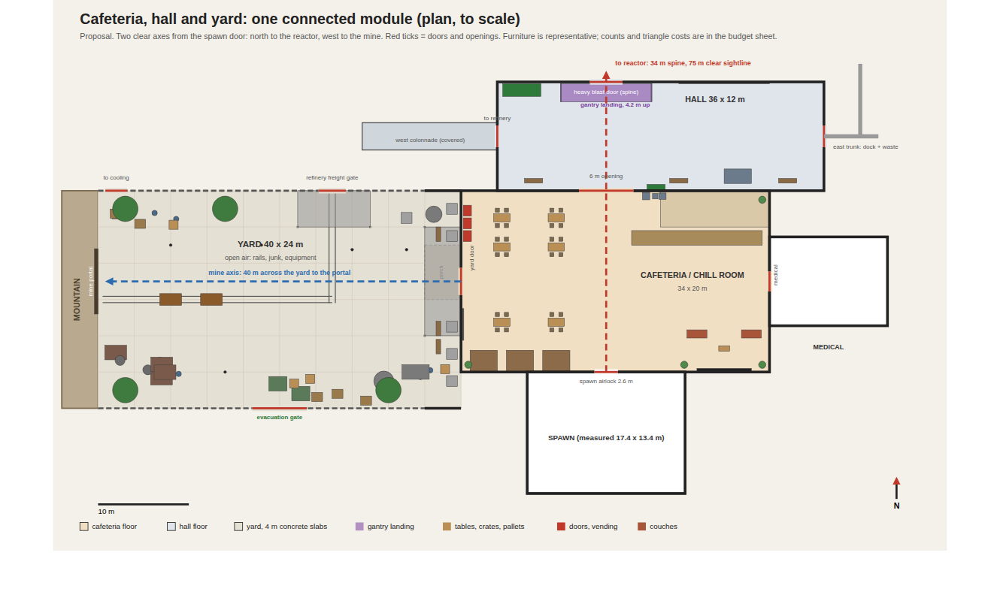
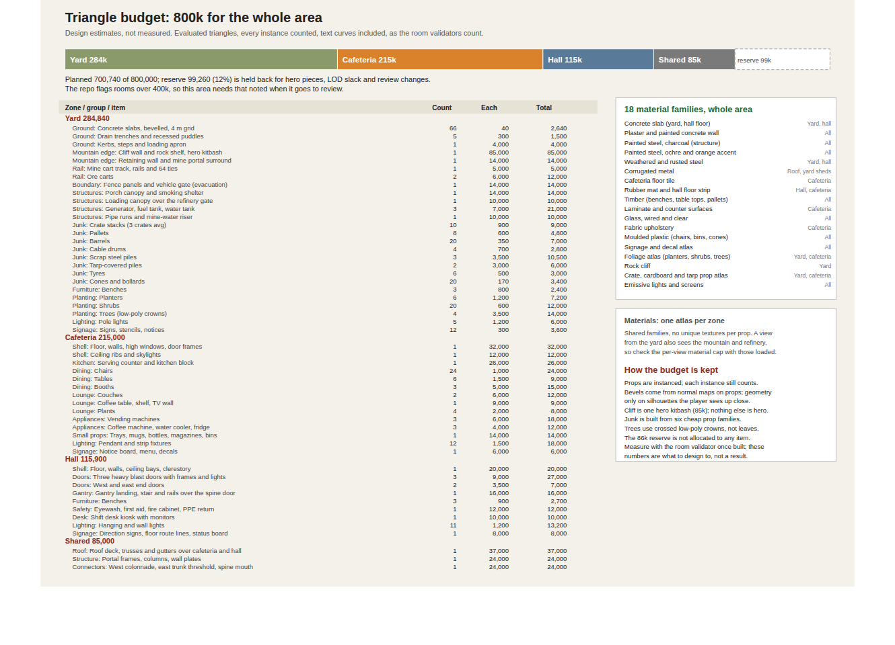
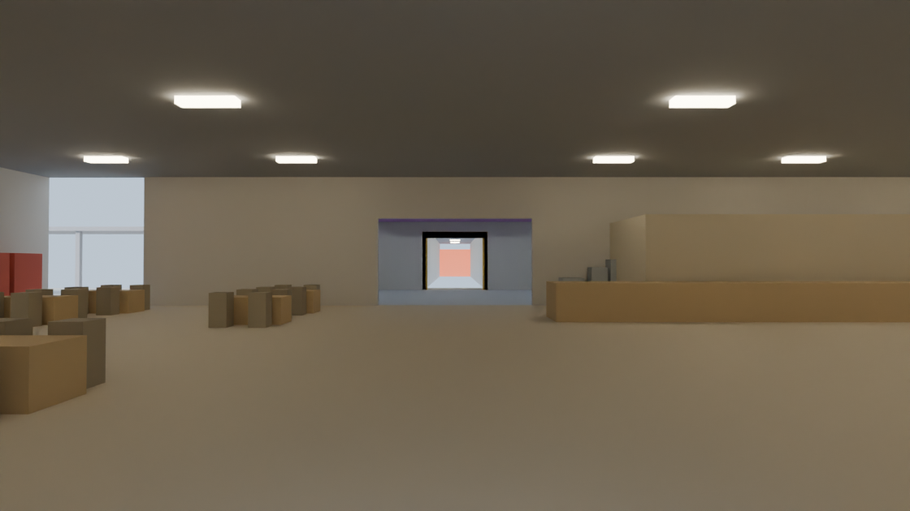
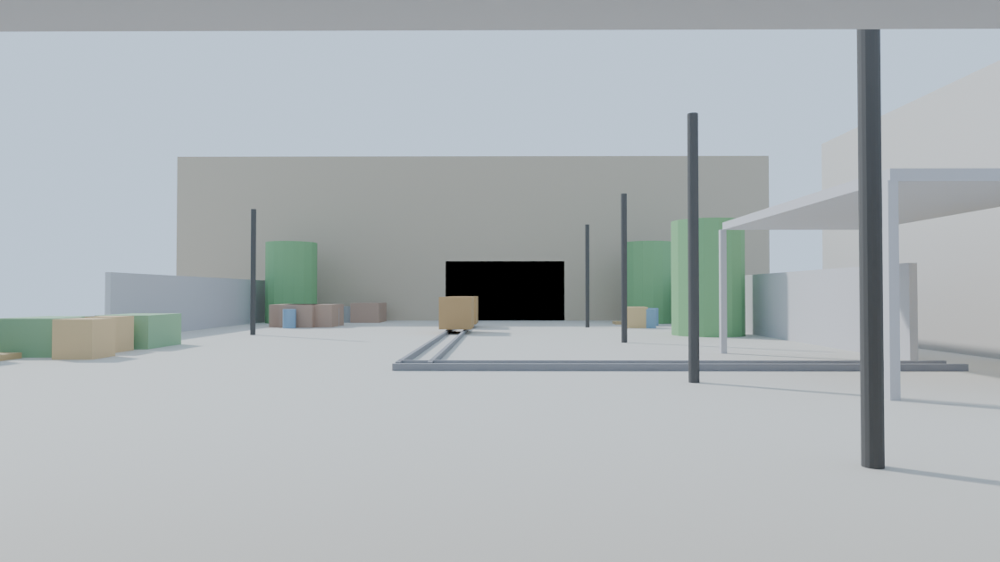
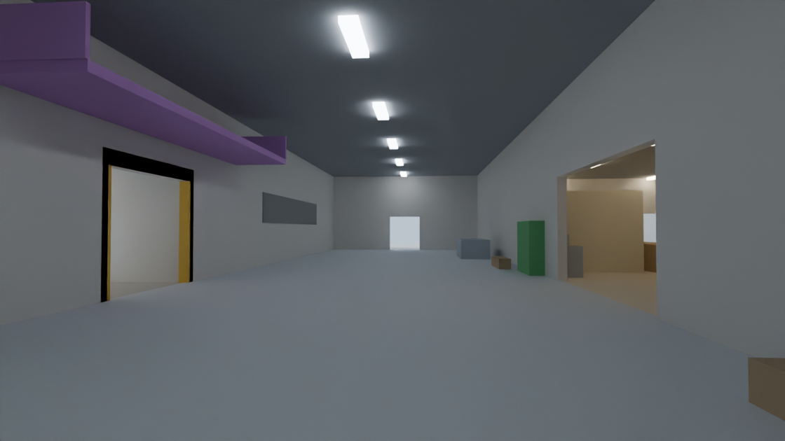
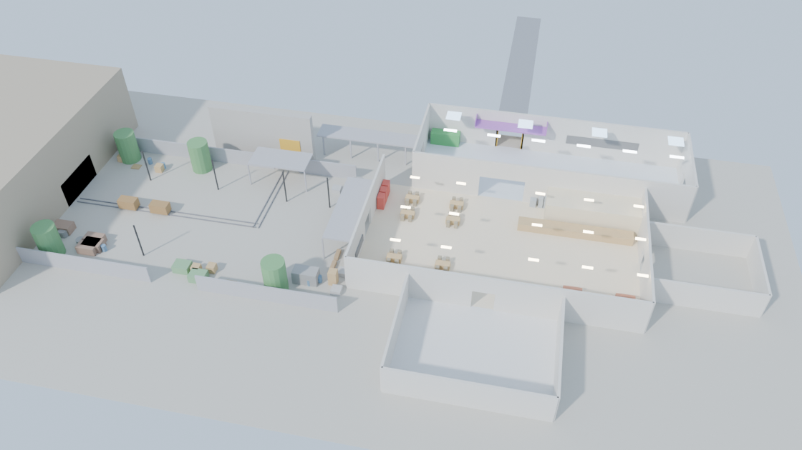

# Cafeteria, hall and yard: design package

**Status: proposal, first build exists (unreviewed).** Drafted with the owner on 2026-10-04 and revised after the owner's review notes (section 3). The first build is in `sections/facility-assembly/sources/front-end-area/`; it is not reviewed or accepted. The concept views and plan below predate the review notes. Sizes of the three
zones are proposals (the repo gives none); the spawn room, medical and every neighbouring room are at their measured sizes.
Numbers marked "estimate" are design targets, not measurements.

## 1. One connected module, three zones
The yard, cafeteria and hall are one module in one file with one roof language (steel portal frames, corrugated and
standing-seam roofs, charcoal steel with ochre accents). They are zones, not separate buildings:

| Zone | Size | What it is |
|---|---|---|
| Hall | 36 x 12 m, 6 m ceiling | Junction. Three ways on: west colonnade to the refinery, a heavy door onto the 34 m spine to the reactor, and one east door onto the trunk that splits to the dock and waste. |
| Cafeteria / chill room | 34 x 20 m, 5 m ceiling | First room after spawn. Warm, social, the pace-setter before the danger. Shares a 6 m opening with the hall. |
| Yard | 40 x 24 m, open air | Staging and logistics. Rail from the mine, junk and equipment, evacuation gate, the cliff on its west edge. A 4 m covered porch joins it to the cafeteria. |

Compared with plan v7 the 6 m connectors between rooms are gone: the cafeteria now touches the hall, and the yard touches the
cafeteria through the porch. That moves the spawn 12 m north and shortens the front end. The spawn exit to the reactor
is about 66 m (15 s walking) and the spawn exit to the mine portal is also about 66 m (15 s).

## 2. Two axes, one choice
From the spawn door the player sees the whole decision:
- **Reactor axis (x = 8):** spawn door, cafeteria aisle, 6 m opening, hall, heavy spine door, 34 m spine, reactor door. A 75 m
  straight sightline ending on a lit red door.
- **Mine axis (y = -70):** cafeteria west door, porch, 40 m across the yard to the mine portal under the cliff.

Both axes keep a 2.4 m clear lane. Furniture, junk and planting stay off them.

## 3. Zone briefs (revised after the owner's review notes, build v1)
The whole area follows the **spawn room's look** (dusty-lilac walls over a navy dado, terracotta tile, warm bright light, daylight
outside) and is **lightly run-down, about two years of use, not abandoned**: faint dust and scuffs, a few uneven slabs, nothing broken
for effect. Props are built at the spawn room's level of detail.

### Yard (open air, mine surface depot)
Revised after the owner's review (2026-10-05): the yard is the surface depot of the mine, not a scrapyard. Everything in it has a job.
- **Portal (west):** the mine portal in a flattened rock face, built as a concrete collar with piers and lintel (7.2 m clear opening, 3.9 m high), steel jamb liners, hazard-striped soffit, three timber sets in the mouth, entrance plate, lamps, rock bolts and safety mesh on the face above. A ventilation fan stands beside it. Natural cliff with benches and jointing (no block pattern).
- **Lamp room:** a site cabin south of the mine lane (tag in and out, board with the rules) and ore cars (numbered) on the rail.
- **Rail and ore:** the rail starts at the centre of the portal (y = -70), runs east over a flush track scale, turns north at x = -22.2 and leaves through the refinery freight gate. Three push-wall bays hold ore grade A, grade B and waste rock, served by a skid loader.
- **Rail dock:** two loading docks either side of the freight gate under the loading canopy (supplies in: parcels, drums, hand truck), a forklift on the apron, amber beacons and a hazard threshold.
- **Vehicle bay and fuel:** three marked bays with wheel stops (utility pickup, crew van, forklift) and a bunded diesel station with pump, signage and bollards.
- **Store:** three containers (spares, tools, consumables and PPE), a marked muster area, a fenced generator and a water tank by the evacuation gate.
- **Porch:** at the cafeteria door, benches, PPE check and site rules boards, recycling, planters.
- Keep-clear: the mine lane (y -71.4 to -68.6), the refinery rail strip (x -23.5 to -20.9, y > -70.5), the evacuation path (x -29.7 to -26.3, y < -71.2), the north-west service door path (x -47.4 to -44.8, y > -68.8) and the porch.
- Ground: concrete apron in 4 m slabs with light wear (four slightly sunk, two cracked), no missing slabs; painted lane edges, bay lines and hatching; trench drains; decals for traffic, skids and oil. Fence with three gates (freight, evacuation, cooling-plant service door), poles with LED floodlights.
- All signage lettering is baked into the sign atlas. Light run-down wear only.

### Cafeteria / chill room
- **A full cafeteria**: ten four-seat tables in east and north-middle blocks plus two booth banks, facing a **kiosk / serving area** in the north-east:
  serving counter, ordering kiosk, queue stanchions, kitchen block, two vending machines.
- **A lounge on the left (west) side**, south of the west door: 3-seat and 2-seat sofas, two armchairs, coffee table, bookcase, rug and a TV on the south wall. It is not shrunk or moved by the dining or game areas.
- **A small game corner** in the north-west (about 7 x 6 m): foosball, arcade basketball and a dartboard with an oche line.
- Aisle: a 2.4 m lane on x = 8 from the spawn door to the hall opening, and 2.4 m lanes to the yard and medical doors.
- Light: working ceiling strips and pendants, daylight through the skylights.

### Hall (narrowed by a refit)
- The hall footprint is unchanged, but its free width is cut by a refit in progress: scaffold tower, plasterboard and cement stock,
  racking, jersey-barrier chicanes at the cafeteria opening and along the door line, sandbags, and one small cordoned ceiling
  collapse with rubble.
- The route is a clear 2.4 m on the reactor axis (x = 6.8 to 9.2) and on the west door to east door line (y = -55.3 to -52.7).
- Heavy blast door on the spine (3.6 x 3.2 m), plain 2.4 m doors at both ends, gantry landing 4.2 m up over the spine door,
  shift desk, safety station, PPE rack, status board.
- Light: cool-white strips, a clerestory, amber beacons at the spine door.

## 4. Doors and openings
| Opening | Size (clear) | Notes |
|---|---|---|
| Spawn exit to cafeteria | 2.6 m | Measured: the built spawn exit is a two-leaf steel airlock, 2.58 m clear and about 2.6 m high. The scenery spec's 1.5 to 1.8 m predates it. Keep the built width. |
| Cafeteria to hall | 6 m opening | Open arch, can take a rolling shutter. |
| Cafeteria to yard | 3 m double door | Onto the porch. |
| Cafeteria to medical | 2.2 m | Measured width of medical's only door. |
| Hall to spine (reactor) | 3.6 x 3.2 m | Heavy blast door. |
| Hall to refinery | 2.4 m | West colonnade, 15 m, covered. |
| Hall east end to east trunk | 2.4 m | The trunk splits just outside: dock one way, waste the other. |
| Yard to refinery freight gate | 3 m | Rail passes through. |
| Yard to cooling passage | 2.4 m | North-west corner. |
| Yard evacuation gate | 6 m | South edge. |
| Mine portal | 7.2 m | In the cliff. |

## 5. Triangle budget (800k)

Planned about 701k of 800k with a 99k (12%) reserve: yard 285k, cafeteria 215k, hall 116k, shared shell 85k. Shortening the hall from 44 m to 36 m saved about 13.5k. The repo flags
rooms over 400k, so this area needs that noted at review. These are design estimates with each instance counted;
the real figure comes from the room validator once something is built.

## 6. Materials
Eighteen shared families for the whole area (listed on the budget sheet), one atlas per zone. A view from the yard also
sees the mountain and the refinery, so the per-view material cap has to be checked with those loaded.

## 7. Concept views
Greybox views built from the same layout data (plain boxes, no materials or art). They check scale, sightlines and clearances.
Not the module.

## 8. If this is approved
1. Shell blockout at real size, then a triangle count against the budget before any prop work.
2. Yard, then cafeteria, then hall, counting after each.
3. Lighting and material pass, then the room validator and a reach check on the doors.
4. Independent review before anything is called finished.

## 9. Open questions for the owner
- Are the three zone sizes right, or should the cafeteria or yard grow or shrink?
- Is the cafeteria scenery only, or should anything in it be interactive?
- Is the south yard gate how players leave the facility during evacuation?
- Do the hall doors lock during a meltdown (the spec lists "restore blast door" as an objective)?
- The hall is 36 x 12 m (432 m2), down from 44 x 12 m. Keep, or shorten further?
- The area is about 701k against a 400k flag. Accept, or trim?
