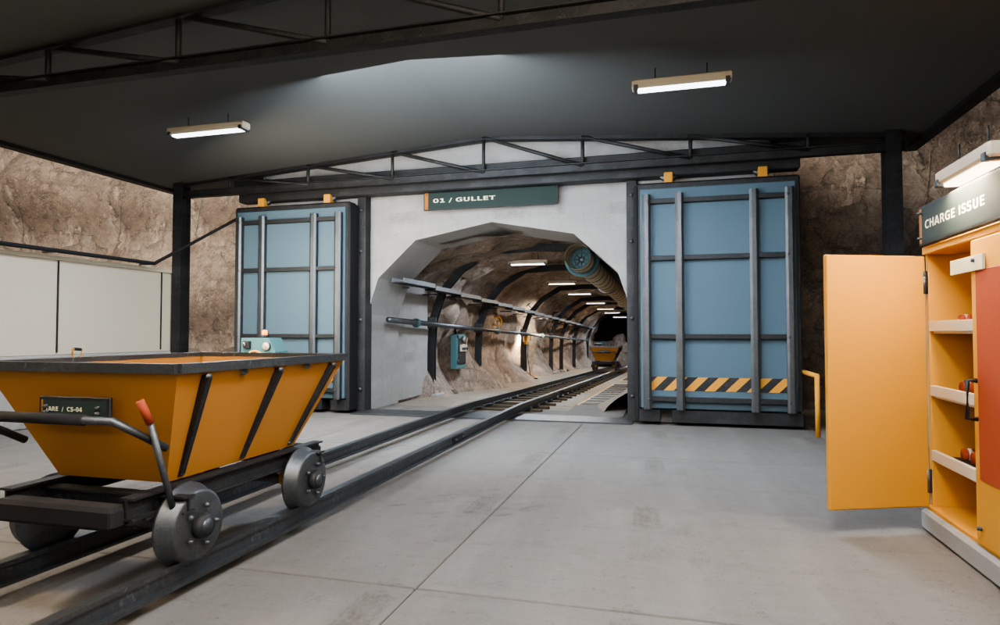
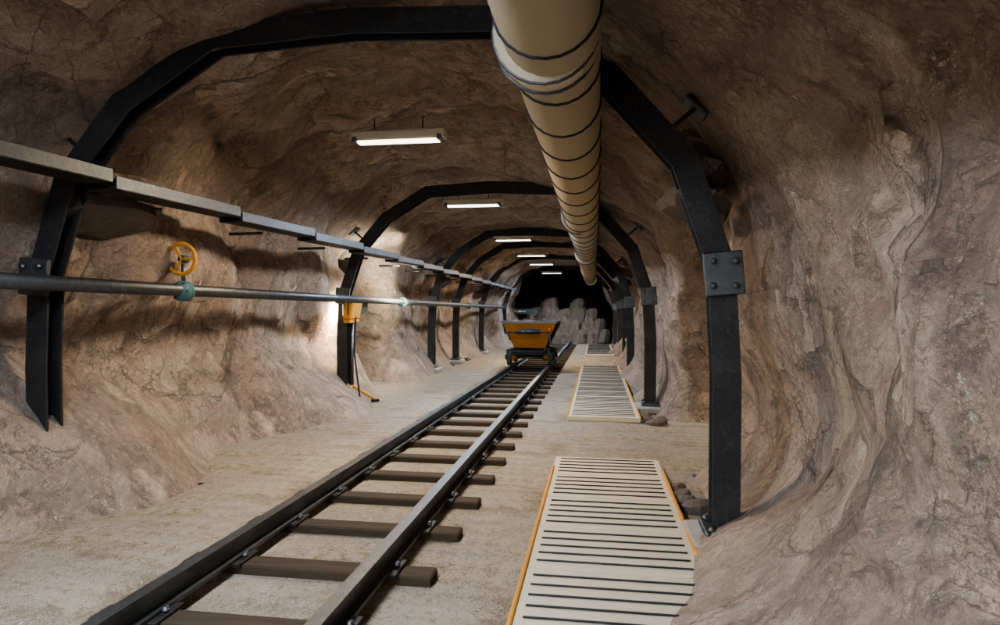

# Gullet Mine: AGENT READ FIRST

**Current revision: 1.1.0-cc0-cycles, 6 September 2026.** Read this before editing, building, importing or rendering the mine. This revision supersedes the rejected green-grey/VTK diagnostic-preview delivery.

## Authority and status

The gameplay specification, `design/ART_DIRECTION.md`, `design/AUTONOMOUS_SECTION_BUILD_PROTOCOL.md`, and `sections/mine/scenery/mine.md` remain authoritative. The visual target is grounded stylized semi-realism, not a primitive web demo, glossy sci-fi or unrestricted photographic grunge.

The scene has now actually been built and rendered in **Blender 5.2.1 LTS / Cycles**. A second repository-runner build and fresh-process check also passed. This is a verified material/lighting repair, not a declaration of complete production art acceptance or Unity integration. Read `production/MATERIAL_REVIEW.md` and `production/TASK_STATE.md` for the remaining gates.

**Do not use Three.js or VTK previews as acceptance evidence. Do not run the preserved geometry source as a replacement for the current material build.**

## Open the delivered scene

`sections/mine/blender/gullet/Gullet_MaterialReview.blend`

Scene-used image textures are packed. Use Rendered shading or render a saved camera to evaluate authored lighting. Solid shading is not a texture preview. After reopening, run the adjacent `register_controls.py` to restore the Gullet sidebar without rebuilding. Do not enable arbitrary script auto-execution.

## Canonical source

`sections/mine/blender/gullet/build_mine.py` is the entrypoint. It invokes `pbr/build_textured_mine.py`. `geometry_source.py` preserves the existing geometry/state source fragments and the import API used by audit/control tools.

The selected CC0 texture originals are committed under `sections/mine/assets/pbr/`, with per-map SHA-256 values and source/license URLs in `download_manifest.json`. The builder checks those hashes and fails explicitly for missing or altered maps; it does not silently fall back to the old flat palette.

For a fresh source build:

```bash
cd sections/mine/blender/gullet
python -m pip install -r tools/requirements-authoring.txt
python tools/prepare_assets.py
blender --background --factory-startup --python-exit-code 1 --python build_mine.py -- --output ./output_pbr --render entry --samples 64 --width 1440
```

The authoring requirements file supplies numpy, Pillow and scikit-image. Blender consumes the resulting geometry/signage plus the committed material library. If the downloaded originals need intentional restoration, use:

```bash
python pbr/download_materials.py
python pbr/download_geology_detail.py
```

Use `--mode intact` for sealed initial sectors or default `--mode showcase` for different sector states. Use `--render all` for all ten fixed cameras. For a real cold start:

```bash
blender --background output_pbr/CriticalShift_Gullet_PBR.blend --python-exit-code 1 --python pbr/validate_blender.py -- --output ./validation/blender --render entry
```

## Materials and appearance

Six 2K CC0 sets are used: Poly Haven `rock_face_03`, `quarry_wall`, `rock_surface`, `gravel_ground_01`; ambientCG `Concrete046`, `Metal046B`. The material library contains 24 original image maps. Palette, saturation, roughness, scale and bump are art-directed in Blender, not used as an indiscriminate grunge overlay.

The main rock has bounded relief, the floor uses dusty gravel/concrete, structure is charcoal steel, carts are ochre, doors are slate blue-grey, and teal is limited to selected equipment/signage. Groundwater is separate from rock and paint. Scene-used images are packed into the `.blend`.

Box-projected surfaces use height-based bump, not incorrectly oriented tangent normals. The original normal maps are retained for subsequent baking. Blender's node graph and lighting will not automatically transfer through FBX/glTF: bake or recreate the materials for Unity and compare actual in-engine frames.

## User-approved layout and behaviour to preserve

- Shallow 2.5% descent into the mountain; no mine lift or elevator.
- Covered preparation bay, facility connection, cart staging, fictional charge pickup, instructions, tools and substantial sliding blast gate.
- Three independent sectors: dry, wet and deep. Larger valid events unlock genuinely larger excavation volumes.
- Excessive events create a blocked collapse with 22 individually identified removable rubble pieces per sector.
- Unlocks are monotonic. A smaller later event cannot close opened geometry, and another event cannot erase uncleared collapse rubble.
- Working rails, pedestrian route, maintenance loop, supports, ventilation, cables, pump and recessed sump.
- Instruction indices are fictional game balance, never real explosive engineering formulas.

## Evidence to inspect

Repository render evidence: `production/renders/review/cc0-materials/`.

Repository build logs and cold-start report: `production/checkpoints/cc0-materials/`.





The cold-start checks exercise real bpy state/gate/rubble controls, packed-image availability, finite mesh data, IDs, UVs, fixed cameras and sampled standing-path clearance. They are not a complete character-controller sweep, physics simulation or artistic score.

## Runtime and final-acceptance boundary

Unity still requires pickups, detonation, cart/rubble physics, networking, navigation, collider preparation, audio/VFX, material baking/recreation, gameplay-camera comparison and target-hardware testing. Preserve editable hierarchy and deterministic source while making corrections. Do not fix only the saved scene and leave regeneration broken.

The focused three-stage material review does not replace the full four-cycle production acceptance protocol. Some face/collapse geometry remains simplified and repetitive; record further artistic decisions explicitly.

Cameron's supplied workstation: Radeon RX 9070 XT, Ryzen 7 5800X, 32 GB DDR4. Prefer HIP when available and fall back to CPU. The recorded verification used CPU; Radeon performance is not yet measured.
